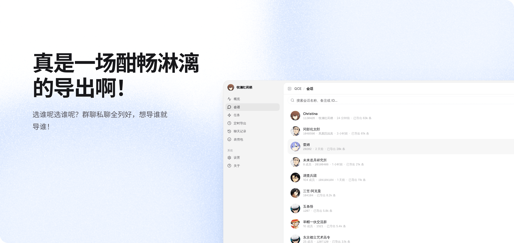
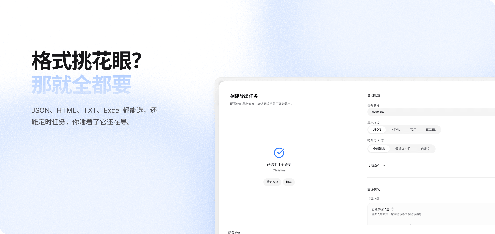
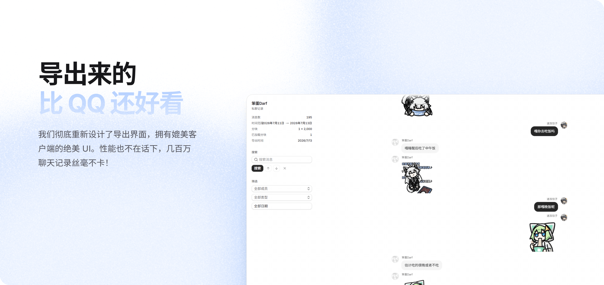
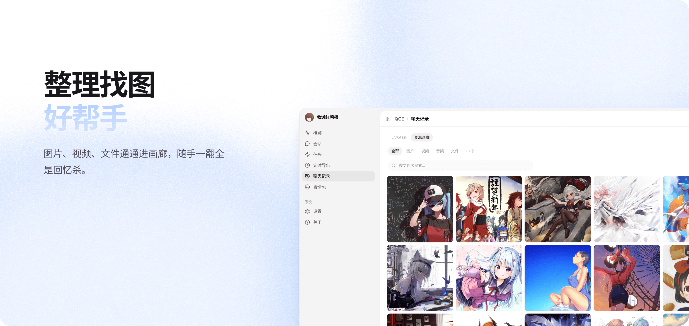
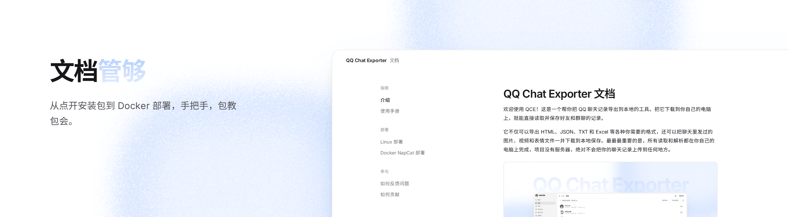

[![][image-banner]][releases-link]

这是一个帮你把 QQ 聊天记录导出到本地的工具。把它下载到你自己的电脑上，就能直接读取并保存好友和群聊的记录。

它不仅可以导出 HTML、JSON、TXT 和 Excel 等各种你需要的格式，还可以将聊天中发过的图片、视频和表情文件一并下载到本地保存。最最最重要的是，所有读取和解析都在你自己的电脑上完成，项目没有服务器或数据传输，绝对不会把你的聊天记录上传到任何地方。

**[使用文档][docs-link]** **[下载][releases-link]** **[Docker 部署][docker-doc]** **[反馈问题][issues-link]**

[![][github-release-shield]][releases-link]
[![][github-downloads-shield]][releases-link]
[![][github-stars-shield]][stars-link]
[![][github-license-shield]][license-link]

> \[!IMPORTANT]
>
> **Star 一下**，你将第一时间收到 GitHub 上的新版本发布通知

## 特性









## 快速开始

### Windows 一键安装（推荐）

1. 从 [Releases][releases-link] 下载一键安装包并运行
2. 用 QQ 扫码登录
3. 打开 `http://localhost:40653/qce`，开始导出

### Shell 模式（Windows / Linux）

1. 从 [Releases][releases-link] 下载对应平台的压缩包
2. 运行 `launcher-user.bat`（Windows）或 `./launcher-user.sh`（Linux）
3. 用 QQ 扫码登录，复制控制台输出的 Token
4. 打开 `http://localhost:40653/qce`

### Docker 一键部署

适用于 macOS（含 Apple Silicon）、Linux、Windows，无需安装 QQ 客户端：

```bash
git clone https://github.com/shuakami/qq-chat-exporter.git
cd qq-chat-exporter/docker
docker compose up -d

# 查看登录二维码与 Token
docker logs -f napcat-qce
```

> \[!NOTE]
> Apple Silicon (M1/M2/M3/M4) 通过 Rosetta 模拟运行，首次启动可能稍慢。详见 [Docker 部署指南][docker-doc]。

## 文档

[][docs-link]

## 相关项目

| 项目 | 说明 |
| --- | --- |
| [ChatLab](https://chatlab.fun/cn) | 深入分析聊天内容 |
| [QCE2ChatLab](https://github.com/Ruoan-486/QCE2Chatlab) | QCE 导出自动导入 ChatLab，支持定时同步 |
| [QQChatAnalyzer](https://github.com/CutrelyAlex/QQChatAnalyzer) | 个人 / 群聊分析、社交网络可视化和 AI 摘要 |
| [QQ-Chat-AI-Analyzer](https://github.com/JUSTMONIKA2022/QQ-Chat-AI-Analyzer) | 基于 AI 的群聊消息总结分析，可生成年度报告 |
| [napcat-qce-python](https://github.com/streetartist/napcat-qce-python) | Python API 封装 |

## 贡献者

感谢每一位让 QCE 变得更好的贡献者，也感谢 [NapCatQQ](https://github.com/NapNeko/NapCatQQ) 团队提供的框架支持。参与开发？请阅读[贡献指南](docs/contributing.md)。

<a href="https://github.com/shuakami/qq-chat-exporter/graphs/contributors">
  
</a>

## 许可证

[GPL-3.0][license-link]

<!-- LINK GROUP -->

[image-banner]: docs/images/banner.png
[docs-link]: https://shuakami.github.io/qq-chat-exporter/
[releases-link]: https://github.com/shuakami/qq-chat-exporter/releases
[issues-link]: https://github.com/shuakami/qq-chat-exporter/issues
[stars-link]: https://github.com/shuakami/qq-chat-exporter/stargazers
[license-link]: https://github.com/shuakami/qq-chat-exporter/blob/main/LICENSE
[docker-doc]: docs/docker-napcat-deployment.md
[github-release-shield]: https://img.shields.io/github/v/release/shuakami/qq-chat-exporter?color=317cfe&labelColor=black&logo=github&style=flat-square
[github-downloads-shield]: https://img.shields.io/github/downloads/shuakami/qq-chat-exporter/total?color=317cfe&labelColor=black&style=flat-square
[github-stars-shield]: https://img.shields.io/github/stars/shuakami/qq-chat-exporter?color=317cfe&labelColor=black&style=flat-square
[github-license-shield]: https://img.shields.io/badge/license-GPL--3.0-317cfe?labelColor=black&style=flat-square
