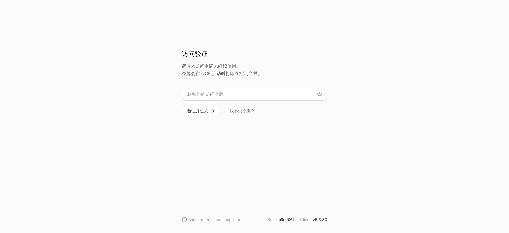
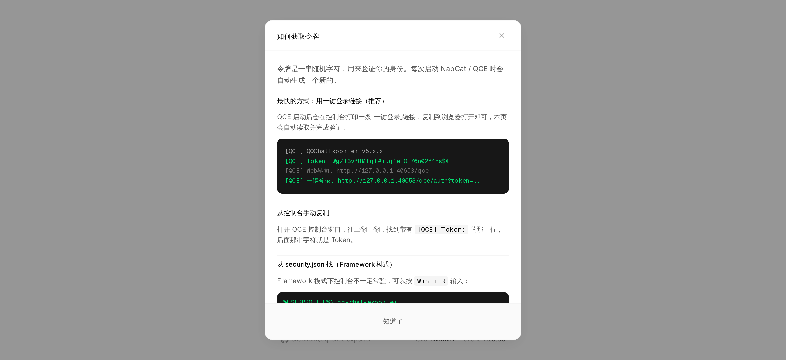

# 下载与版本选择

你可以在 [GitHub Releases](https://github.com/shuakami/qq-chat-exporter/releases) 页面获取以下不同版本的程序包：

| 包类型 | 适用平台 | 说明 | 对应文件名 |
| --- | --- | --- | --- |
| <mark data-tip="推荐！">一键安装包</mark> | Windows 7+ x64 | 自带运行环境，双击自动安装，支持快捷登录并自动打开操作网页。 | `QQChatExporter-Installer-vxxx.exe` |
| Shell 模式 | Windows x64 | 独立在后台运行的无界面 QQ，适合服务器运行或自动化备份。 | `NapCat-QCE-Windows-x64-vxxx.zip` |
| Shell 模式 | Linux x64 | 独立的无界面 Linux QQ 运行包，适合服务器部署或 Docker 环境。 | `NapCat-QCE-Linux-x64-vxxx.tar.gz` |
| Framework 模式 | Windows | 桌面 QQ 的插件版本，可以与你平时聊天的 QQ 客户端共存。 | `NapCat-Framework-QCE-vxxx.zip` |
| NapCat 插件商店包 | 跨平台 | 专给已经配置好 NapCat 环境的用户使用，可在插件商店直接装。 | `napcat-plugin-qce.zip` |

### Windows 用户

* **绝大多数用户**：直接下载[当前最新版本](https://github.com/shuakami/qq-chat-exporter/releases/latest)下的一键安装包。双击安装后软件会自动提示扫码或快捷登录，然后弹出网页界面。
* **需要与日常 QQ 共存**（比如说想一边照常挂着 QQ 聊天，一边让工具在后台跑定时备份）：下载 `NapCat-Framework-QCE-vxxx.zip`，并参考下文的 [Framework 模式使用方法](#framework-usage)。

---

### 各个版本

#### 一键安装包

安装程序会自动配置好后台环境和登录逻辑，安装完毕后自动在浏览器中打开 Web 操作界面。如果以后不需要了，运行安装目录里的 `Uninstall QQ Chat Exporter.exe` 即可完全卸载。或者在设置里面找到 QCE 应用卸载。

#### Shell 模式

在后台启动一个没有图形界面的 QQ 进程，需要你使用手机 QQ 扫码登录。由于没有桌面客户端，它全程在控制台（黑底白字的命令行窗口）里运行。

> 具体运行步骤见下文[启动引导](#start-guide)中的 [A. 完整模式](#full-mode)。

#### Framework 模式

作为插件注入到电脑上现有的桌面版 QQ 中，直接共享你已经在桌面 QQ 上登录的账号。适合不想重复扫码登录、想让工具在后台静默跑定时任务的场景。

---

### Framework 模式使用方法 {#framework-usage}

根据你的实际情况选择以下一种方式安装，切勿将两种方法混在一起操作：

#### 方式 A：直接运行 `napiLoader.bat`（推荐普通用户使用）

*此方式不需要你提前安装 LiteLoaderQQNT 插件框架。*

1. 下载 `NapCat-Framework-QCE-vxxx.zip` 并解压到一个固定的文件夹（例如你的文档目录）。
2. **必须先完全退出电脑上已经打开的 QQ 客户端**。
3. 进入解压后的文件夹，双击运行 `napiLoader.bat`。
4. 此时 QQ 会自动启动并弹出登录页，按照平时的方式登录你的账号即可。
5. 打开浏览器，访问 `http://localhost:40653/qce`，按照下文[登录 Web 界面](#login)的方法找到安全令牌并输入。

#### 方式 B：LiteLoaderQQNT 插件方式

*仅在你本来就在使用 LiteLoaderQQNT，或者明确想通过插件目录来管理 NapCat 时才用。*

1. 确保你已经按照 LiteLoaderQQNT 官方文档装好了框架，并在 QQ 设置左侧能看到 LiteLoaderQQNT 选项。
2. 将 Framework 包解压，并按照 LiteLoaderQQNT / NapCat 的常规插件部署要求放入对应的 plugins 目录。

---

## 启动引导 {#start-guide}

Shell 模式和 Framework 模式下载解压后即可直接运行，无需在电脑上配置其他复杂的系统环境。

### 第一步：解压文件

去 Releases 页面下载对应的压缩包并完整解压。再次提醒，**不要下载 Source code 源码包**。

### 第二步：选择模式启动

Shell 包有两种启动方式，根据你的实际需求选择：

#### A. 完整模式（需要登录 QQ，用于导出新记录） {#full-mode}

* **Windows**：双击运行 `launcher-user.bat`
* **Linux**：运行 `./launcher-user.sh`（首次在服务器部署请参考 [Linux 部署指南](linux-deploy.md)）
* **操作**：运行后留在黑色的控制台窗口中，用手机 QQ 扫描里面打印出来的二维码登录。
* **进入界面**：看到控制台打印出 `Web界面: http://127.0.0.1:40653/qce` 这行字后，说明启动成功，此时可以用浏览器访问该地址。如果没看到这行字，先不要刷新网页。

#### B. 独立模式（不需要登录 QQ，只看以前导出的本地文件）

* **Windows**：双击运行 `start-standalone.bat`
* **Linux**：运行 `./start-standalone.sh`
* **操作**：直接在浏览器访问 `http://localhost:40653/qce`，该模式不需要输入安全令牌。

---

### 第三步：登录 Web 界面 {#login}

在完整模式下，首次打开 `http://localhost:40653/qce` 会看到一个需要输入访问令牌（Access Token）的验证页面：



你可以通过以下几种方法找到这串令牌：

#### 方法 1：从 `security.json` 配置文件中查找（最稳妥）

Windows 用户按下键盘上的 `Win + R` 键，输入 `%USERPROFILE%\.qq-chat-exporter` 并回车；Linux 用户查看 `~/.qq-chat-exporter/` 目录。
用记事本打开该目录下的 `security.json`，找到 `accessToken` 字段：

```json
{
  "accessToken": "<复制这一串字符，这就是你的访问令牌>",
  "createdAt": "2026-07-14T00:00:00.000Z",
  "allowedIPs": ["127.0.0.1", "::1"],
  "tokenExpired": "..."
}
```

把那一串长字符复制并粘贴到网页的输入框里，点击验证即可进入。

#### 方法 2：从控制台日志复制

部分版本启动时，黑色的控制台窗口里会直接打印出 `[QCE] Token: xxx` 这一行，后面的字符就是令牌；如果打印了类似 `http://127.0.0.1:40653/qce/auth?token=...` 的链接，直接复制到浏览器打开就能自动跳过验证。新版本由于安全考虑可能会隐藏此打印，若没看到，请统一使用方法 1。

#### 方法 3：一键安装包用户

安装程序会自动处理验证逻辑并开启网页，通常不需要你手动查找令牌。

提示：在令牌有效期内，重启软件令牌是不会变的。如果提示登录失败，请确认你复制的是当前最新生成的 `security.json` 里的内容。登录页上的「找不到令牌？」按钮也附带了相同的图文引导：



#### 浏览器打不开 `http://localhost:40653/qce` 怎么办？

如果浏览器提示 `ERR_CONNECTION_REFUSED`（连接被拒绝），通常不是浏览器的问题，而是 **QCE 后台程序根本没有运行成功**。

请按照以下顺序检查：

1. 检查黑色的控制台命令行窗口是否还在，有没有被误关闭。
2. 观察控制台里是否有红色的报错文本。如果没有看到 `Web界面: http://127.0.0.1:40653/qce` 这行字，说明程序还没跑起来，此时刷新网页没有任何作用。
3. 检查自己运行的文件对不对：完整模式必须运行 `launcher-user.bat`，独立模式运行 `start-standalone.bat`。
4. **不要直接双击运行 `napcat.mjs`，也不要把 GitHub 上的 `Source code` 源码包当作安装包来双击哟**
5. 退出了已有的、已登录的 QQ 吗
6. 如果反复失败，建议回到 Release 页面重新下载官方发布包，找个干净的目录完整解压后再试。这可以解决一半的问题！

---

## 导出聊天记录

成功进入网页界面后，点击左侧菜单的 **“会话”**，这里会列出你的所有双人好友和加入的群聊。


### 基础操作步骤

1. 你可以在列表中找到你要备份的好友或群聊
2. 点击该行右侧的 **“导出”** 按钮。
3. 在弹出的窗口中选择你需要的格式和时间范围，点击 **“创建任务”**。
4. 页面会自动切换到左侧的 **“任务”** 页面查看进度，等待状态变成完成后，可以直接点击下载，或者打开文件在电脑上的存放位置。

### 设置项

创建导出任务时的弹窗界面如下：


* **格式选择**：
    * <mark>`HTML`：导出为标准网页文件。排版样式与手机 QQ 聊天界面一致，适合日常直接双击打开阅读。</mark>
    * `JSON`：纯结构化数据文件，适合有编程基础、需要自己写脚本分析数据的用户。
    * `TXT`：纯文本文件，不包含任何图片、视频和表情包，文件体积非常小。
    * `Excel`：表格文件，方便后续通过表格软件进行关键词筛选、数据统计或排序。
* **媒体资源（图片/视频/表情）**：
默认会同步下载。需要特别注意：导出 HTML 格式时，会同时生成一个 `.html` 文件和一个 `resources` 文件夹。**这两者是一个整体，千万不要把它们分开存放或重命名**，否则打开网页时里面的图片和视频会变成空白。如果需要发给别人，建议勾选“导出为 ZIP”打包输出。
* **时间范围**：
选“全部消息”会抓取该会话在当前电脑上的所有历史记录；如果消息太多，可以选“最近 3 个月”或通过日历自定义时间区间。
* **过滤条件**：
支持输入特定的关键词过滤消息，也可以勾选或取消勾选入群通知、撤回提示等系统日志。

---

## 进阶功能

### 1. 批量导出

如果你想把号上的几十个群全部存下来，不需要一个个点。在“会话”页面点击右上角的 **“批量导出”** 按钮，勾选“全选”或者手动勾选某几个群，点击“导出选中”，统一设置好格式后，让电脑挂机等待任务全部跑完即可。

### 2. 定时自动备份

在“定时导出”页面点击 **“新建定时任务”**。你可以把调度策略设为“每天”。

**一个高效的备份技巧是：将时间范围设为“昨天”**。这样工具每天半夜只会自动增量抓取过去 24 小时产生的新消息，耗时极短。月底时，你可以利用 **“合并备份”** 功能，把每天生成的零碎文件拼接成一个完整的大文件。

### 3. 导出已删除好友或临时对话

如果你想导出的人已经不是你的好友，或者属于没有保存的临时群会话，可以到 **“概览”** 页面点击 **“新建任务”**，选择 **“手动输入QQ号”**，直接输入对方的 QQ 号或群号即可强制建立导出任务。不过具体能不能导出还是取决于本地有没有历史记录QAQ！

### 4. 百万级超大群流式导出

如果是积累了多年的高活跃度大群，消息量可能达到几十万甚至上百万条，普通导出方式有可能会吃满电脑内存！这个时候，你可以在导出弹窗中点开 **“高级选项”**，勾选 **“流式导出”**。开启后，程序会将数据切块分段处理，最终输出一个特殊的 ZIP 包。

解压后打开 `index.html`，网页会采用动态加载机制（也就是，鼠标滚轮滚到哪里，数据就加载到哪里），确保低配电脑和浏览器也能流畅查看百万条记录！

说到这里，你应该学会使用 QCE 了！如果有问题，随时都可以到 [GitHub](https://github.com/shuakami/qq-chat-exporter/issues) 里面找我们哟！
