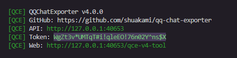
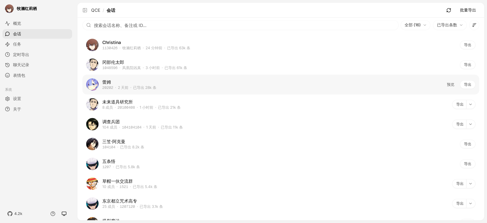
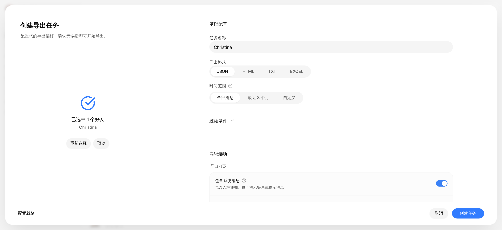

QCE 能把 QQ 聊天记录（好友/群聊）保存到电脑上。支持导出成网页（HTML）、数据（JSON）等格式，且能完整下载图片和视频。

## 目录

1. [下载](#下载)
2. [启动](#启动)
3. [导出聊天记录](#导出聊天记录)
4. [进阶玩法](#进阶玩法)
5. [常见场景](#常见场景)

## 下载

如果你是第一次接触这个项目，先记住下面这三句话：

- **第一次接触项目，或者不想折腾，优先用 Shell 模式。**
- **QQNT 就是现在的桌面版 QQ**，不是另外一个单独的软件名。
- **Windows 普通用户默认下载 `NapCat-QCE-Windows-x64-vxxx.zip` 就够了**，不需要再下载 Linux 包。
- **如果你希望 QCE 和你正在使用的 QQ 共存，例如挂定时任务、后台备份，才选 `NapCat-Framework-QCE-vxxx.zip`。**

### 可用的下载包

| 包类型 | 平台 | 说明 | 文件 |
|--------|------|------|------|
| Shell 模式 | Windows x64 | 独立无头 QQ，适合服务器/自动化 | NapCat-QCE-Windows-x64-vxxx.zip |
| Shell 模式 | Linux x64 | 独立无头 QQ，适合服务器/Docker | NapCat-QCE-Linux-x64-vxxx.tar.gz |
| Framework 模式 | Windows | QQNT 插件，与桌面 QQ 共存 | NapCat-Framework-QCE-vxxx.zip |

去 [GitHub Releases](https://github.com/shuakami/qq-chat-exporter/releases) 下载。

### Windows 用户最简单的选择

- **第一次接触项目，或者只想开箱即用**：优先下载 `NapCat-QCE-Windows-x64-vxxx.zip`
- **已经在用桌面 QQ，并且希望和当前 QQ 共存，比如挂定时任务、后台备份**：下载 `NapCat-Framework-QCE-vxxx.zip`
- **看见 Linux 包可以直接跳过**，那是给 Linux 服务器用户准备的
- **看见 `Source code (zip)` / `Source code (tar.gz)` 也可以直接跳过**，那不是给普通用户安装用的

### 如何选择模式？

#### Shell 模式

独立运行，需要单独登录 QQ，适合服务器部署和自动化备份。这个模式下 QQ 在后台无头运行，不需要桌面界面。  
**如果你是第一次接触这个项目，优先选 Shell 模式。**

> 详细使用步骤请参考下方的 [启动](#start-guide) 中的 [A. 完整模式](#full-mode) 部分。

#### Framework 模式

作为 QQNT 插件运行，与正在使用的 QQ 共享登录，适合 Windows 桌面用户。如果你希望一边正常使用 QQ，一边让 QCE 挂着跑定时任务或后台备份，更适合选这个模式。

> 这里的 **QQNT**，就是你现在电脑上的桌面版 QQ。  
> Framework 模式不是让你再装一个新的 QQ，而是把 QCE 接到你正在使用的桌面 QQ 里。  
> 这种模式尤其适合“QQ 平时照常开着，同时还想让 QCE 在后台继续工作”的场景。

### Framework 模式使用方法

Framework 模式现在请按你准备走的入口来选，不要把两条路混在一起。

#### 方式 A：直接运行 `napiLoader.bat`（推荐普通用户使用）

如果你只是想让 QCE 和电脑上正在使用的 QQ 一起工作，直接走这条路就可以。  
**这条路不要求先安装 LiteLoaderQQNT。**

1. 去 QCE 的发布页下载 `NapCat-Framework-QCE-vxxx.zip`：
   <https://github.com/shuakami/qq-chat-exporter/releases>
2. 把 `NapCat-Framework-QCE-vxxx.zip` 解压到一个你容易找到的位置，例如 `C:\Users\你的用户名\Documents\NapCat\`
3. **重要**：先完全退出已经打开的 QQ，再继续下一步。
4. 在解压后的目录里运行 `napiLoader.bat`
5. 如果 QQ 弹出登录页，按平时的方式登录 QQ。
6. 在 `security.json` 中查找 `token`

<details>
<summary><strong>如何找到 token？</strong></summary>

按 `Win + R`，输入 `%USERPROFILE%\.qq-chat-exporter` 并回车，打开 `security.json` 文件，找到 `accessToken` 字段：

```json
{
  "accessToken": "*lL@*7&PEfNk03t@h^4e@psZlFuAB8G#",
  "secretKey": "MVdUIkfAi#P4QyHrLeZQVdNG!esptU2fEnuNSZSb@or@4#4ARGV2NVLBdbSFD&Pi",
  "createdAt": "2025-12-16T10:42:01.818Z",
  "allowedIPs": ["127.0.0.1", "::1"],
  "tokenExpired": "2026-01-28T10:26:03.879Z"
}
```
那么 `*lL@*7&PEfNk03t@h^4e@psZlFuAB8G#` 就是你要用的 token
</details>

7. 访问 `http://localhost:40653/qce-v4-tool`，使用找到的 token 进行操作

#### 方式 B：LiteLoaderQQNT 插件方式（只有明确要这样装时才用）

如果你本来就在用 LiteLoaderQQNT，或者你明确想按插件目录方式管理 NapCat，再看这条。  
**只有这条路才要求先安装 LiteLoaderQQNT。**

1. 先按 LiteLoaderQQNT 官方文档完成安装：<https://liteloaderqqnt.github.io/>
2. 装好以后，打开 QQ 设置，确认左侧已经出现 LiteLoaderQQNT。
3. 再按 LiteLoaderQQNT / NapCat 的插件安装方式去部署 Framework 包。
4. 如果你只是普通使用，不建议先折腾这条，直接回到上面的 `napiLoader.bat` 路线更省事。

> 这个 `NapCat-Framework-QCE-vxxx.zip` 压缩包本身不是 LiteLoaderQQNT 安装器。  
> 它也不会帮你自动安装 LiteLoaderQQNT。  
> 如果你只是想尽快用起来，优先按上面的 `napiLoader.bat` 路线操作就可以。

## 启动 {#start-guide}

不需要安装任何复杂的环境，下载解压就能用。更多下载选项请参考 [下载](#下载) 章节。

### 第一步：下载

去 [GitHub Releases](https://github.com/shuakami/qq-chat-exporter/releases) 下载对应系统的压缩包，解压到一个文件夹里。

- Windows 普通用户：下载 `NapCat-QCE-Windows-x64-vxxx.zip`
- Linux 用户：下载 `NapCat-QCE-Linux-x64-vxxx.tar.gz`
- 如果你要走 Framework 模式，请看上面的 [Framework 模式使用方法](#framework-模式使用方法)
- **不要下载 `Source code`**

### 第二步：选择模式启动

QCE 有两种启动模式，看你需要干什么：

#### A. 完整模式（我要导出聊天记录） {#full-mode}

*需要登录 QQ，能获取新消息。*

- **Windows**：双击 `launcher-user.bat`
- **Linux**：运行 `./launcher-user.sh`
- **操作**：看黑底白字的控制台窗口，用手机 QQ 扫码登录。
- **打开界面**：浏览器访问 `http://localhost:40653/qce-v4-tool`，输入控制台里显示的 `Access Token`。

> 只有控制台里出现了 `Web: http://127.0.0.1:40653/qce-v4-tool` 和 `Token`，才说明启动成功了。  
> 如果没有看到这两行，先不要急着刷新浏览器。



控制台这个里面选的就是 `Access Token`

> **找不到 Token 或提示错误？**
> 
> 很简单，按住键盘上的 `Win` + `R` 键，粘贴下面这段话并回车：
> `%USERPROFILE%\.qq-chat-exporter`
> 
> 在打开的文件夹里找到 `security.json`，右键用记事本打开，里面的 accessToken 对应的一长串字符就是你的 Token。
> 
> 比如：
> ```json
> {
>   "accessToken": "*lL@*7&PEfNk03t@h^4e@psZlFuAB8G#",
>   "secretKey": "MVdUIkfAi#P4QyHrLeZQVdNG!esptU2fEnuNSZSb@or@4#4ARGV2NVLBdbSFD&Pi",
>   "createdAt": "2025-12-16T10:42:01.818Z",
>   "allowedIPs": ["127.0.0.1","::1"],
>   "tokenExpired": "2026-01-28T10:26:03.879Z",
>   "disableIPWhitelist": false,
>   "lastAccess": "2026-01-21T10:27:37.619Z"
> }
> ```
> 这个 `*lL@*7&PEfNk03t@h^4e@psZlFuAB8G#` 就是我的 Token

#### 浏览器打不开 `http://localhost:40653/qce-v4-tool` 怎么办？

如果浏览器提示 `ERR_CONNECTION_REFUSED`，通常不是“浏览器问题”，而是 **QCE 根本还没有启动成功**。

请按这个顺序检查：

1. 先看黑色控制台窗口还在不在。
2. 如果控制台里有红字报错，或者根本没有出现 `Web: http://127.0.0.1:40653/qce-v4-tool`，说明启动失败了，这时刷新浏览器没有用。
3. 确认你运行的是下面这些文件之一：
   - 完整模式：`launcher-user.bat`
   - 独立模式：`start-standalone.bat`
4. **不要直接双击 `napcat.mjs`，也不要把 GitHub 上的 `Source code` 当成安装包来运行。**
5. 如果还是不行，回到 Release 页面重新下载官方发布包，完整解压后再试一次。

简单说：

- 浏览器能不能打开，取决于本地脚本有没有真正跑起来
- 先看控制台，再看浏览器
- 看不到 `Web` 和 `Token`，就说明还没成功启动

<details>
<summary><strong>启动时提示 <code>Cannot find package 'express'</code> 怎么办？</strong></summary>

如果控制台里出现下面这种报错：

```text
Error [ERR_MODULE_NOT_FOUND]: Cannot find package 'express'
```

通常不是 QQ 本身坏了，而是 **你当前这份 QCE 安装包文件损坏了，或者缺了部分文件**。

最简单的处理方式就是：

1. 回到 Release 页面，重新下载官方完整包。
2. 把压缩包完整解压。
3. 用新下载的完整文件直接覆盖你现在这份 `NapCat-QCE-Windows-x64` 目录。
4. 再重新运行 `launcher-user.bat`。

注意这几个点：

- 不要在压缩包里直接运行。
- 不要只复制其中几个文件出来。
- 如果你是小白用户，优先继续用 Shell 模式，不要先切去折腾 Framework 模式。

</details>

#### B. 独立模式（我只看以前导出的文件）

*不需要登录 QQ，只能查看已下载的备份。*

- **Windows**：双击 `start-standalone.bat`
- **Linux**：运行 `./start-standalone.sh`
- **操作**：直接访问 `http://localhost:40653/qce-v4-tool`，无需 Token。

## 导出聊天记录

进入界面后，看左侧菜单的 **会话 (Sessions)**，这里列出了你的所有好友和群。

### 如何导出？

1. 在列表中找到你想备份的好友或群（找不到点一下右上角"刷新"）。
2. 点击右边的 **导出** 按钮。
3. 在弹窗里选好格式和时间，点 **创建任务**。
4. 去 **任务** 页面看进度，完成后点 **打开文件位置**。



### 关键设置说明

**选什么格式？**

- **HTML**：导出成网页，长得和手机 QQ 界面一样，带头像和气泡，适合人看。
- **JSON**：给程序员用的，或者用来做数据分析。
- **TXT**：纯文字，没图没表情，体积最小。

**媒体资源（图片/视频）**

- 默认会自动下载图片视频。
- **注意**：导出 HTML 时会生成一个 `.html` 文件和一个 `resources` 文件夹。**千万别把它俩分开**，否则图片会加载不出来。
- 推荐勾选"导出为 ZIP"，打包在一起最安全。

**时间范围**

- 不填就是导出所有历史记录。
- 想省时间可以只选最近一个月。



## 进阶玩法

### 批量导出（我想把所有群都存下来）

1. 在 **会话** 页面点右上角 **批量导出**。
2. 点 **全选**（或者手动勾选几个）。
3. 点 **导出选中**，统一设置格式，挂机等它跑完就行。

### 定时自动备份（每天自动存增量）

不想每次手动点？可以设个闹钟自动跑。

1. 去 **定时** 页面 -> **新建定时任务**。
2. **调度策略**：比如选"每天"。
3. **时间范围技巧**：选 **昨天**。这样每天只存过去 24 小时的新消息，速度快。
4. **合并**：月底可以用 **合并备份** 功能，把每天生成的碎片文件拼成一个完整的大文件。

### 导出已删除好友或临时对话

1. 在 **概览** 页面 -> **新建任务**。
2. 点 **手动输入QQ号**。

### 超大群导出（几十万条消息防止卡死）

如果是好几年的老群，消息量巨大（百万级），普通导出可能会让软件崩溃。

- **开启方法**：导出时点开 **高级选项**，勾选 **流式导出 (Stream Export)**。
- **效果**：它会把记录切分成小块处理，生成一个特殊的 ZIP 包，解压后打开 `index.html` 依然能流畅浏览。

## 常见场景

### 场景 1：我要永久保存和某人的聊天记录

- **做法**：找到好友 -> 导出 -> 选 **HTML** 格式 -> 时间留空（全量） -> 勾选 **导出为 ZIP**。
- **结果**：你会得到一个压缩包，存到硬盘或网盘里。哪怕以后 QQ 没了，解压出来双击 html 文件就能完美重现聊天场景。

### 场景 2：定期备份活跃的群聊

- **做法**：新建定时任务 -> 选群 -> 设为"每天"凌晨 3 点 -> 范围选"昨天"。
- **结果**：软件每天半夜自动干活。如果想看完整的，用"合并备份"功能把它们连起来。

### 场景 3：导出百万消息的大群

- **做法**：导出 -> 高级选项 -> 勾选 **流式导出** -> 选 HTML。
- **结果**：得到一个分段加载的网页包。看的时候滚轮滚到哪，它加载到哪，完全不卡。

### 场景 4：只想要文字，不要图片（省空间）

- **做法**：导出时勾选 **快速导出（跳过资源下载）**，或者格式选 **TXT**。
- **结果**：速度极快，几秒钟搞定，文件只有几 MB。

> **遇到问题？** 开发文档和 API 可以在这里看：[DeepWiki API Reference](https://deepwiki.com/shuakami/qq-chat-exporter)
