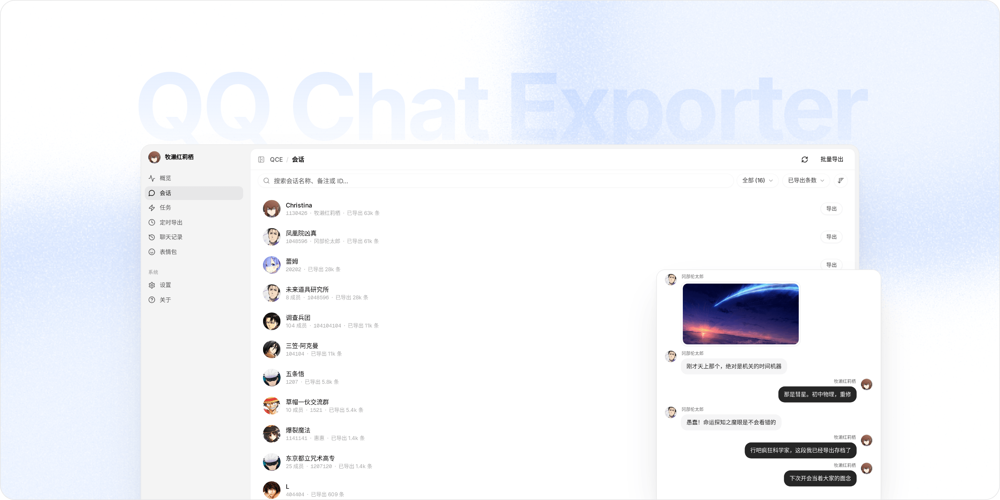

欢迎使用 QCE！这是一个帮你把 QQ 聊天记录导出到本地的工具。把它下载到你自己的电脑上，就能直接读取并保存好友和群聊的记录。

它不仅可以导出 HTML、JSON、TXT 和 Excel 等各种你需要的格式，还可以把聊天里发过的图片、视频和表情文件一并下载到本地保存。最最最重要的是，所有读取和解析都在你自己的电脑上完成，项目没有服务器，绝对不会把你的聊天记录上传到任何地方。

- 如果你是第一次用，可以先看 [使用手册](guide.md)，它会带你从下载、启动到登录导出，一步一步教学。
- 如果你想在 Linux 服务器上跑 QCE，可以参考 [Linux 部署](linux-deploy.md)；喜欢容器化管理的同学，这里也准备了 [Docker NapCat 部署](docker-napcat-deployment.md) 方案。
- 碰到了 Bug 或者程序运行报错？先别急，可以看看 [如何反馈问题](feedback.md) 来帮我们一起抓出问题；要是你想给项目加新功能或改代码，欢迎查看 [如何贡献](contributing.md) 指南。你也可以直接去 [GitHub Issues](https://github.com/shuakami/qq-chat-exporter/issues) 看看别人遇到了什么，或者直接提个新 Bug。
- 你可以在这里 [下载最新版本 (GitHub Releases)](https://github.com/shuakami/qq-chat-exporter/releases)，如果需要开发对接，也可以随时 [查看 API 文档](https://deepwiki.com/shuakami/qq-chat-exporter)。

总之！祝你使用愉快！
